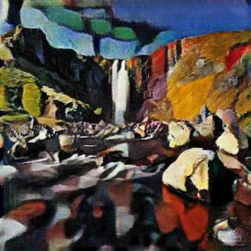
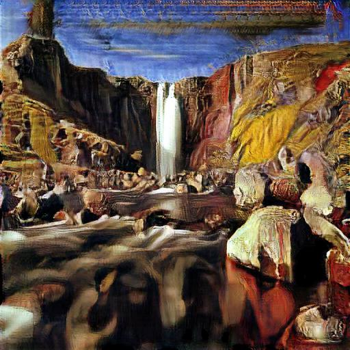
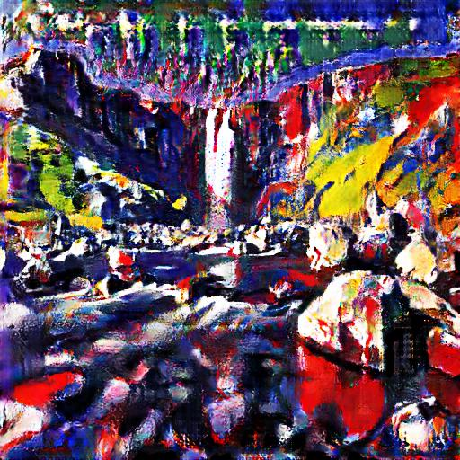
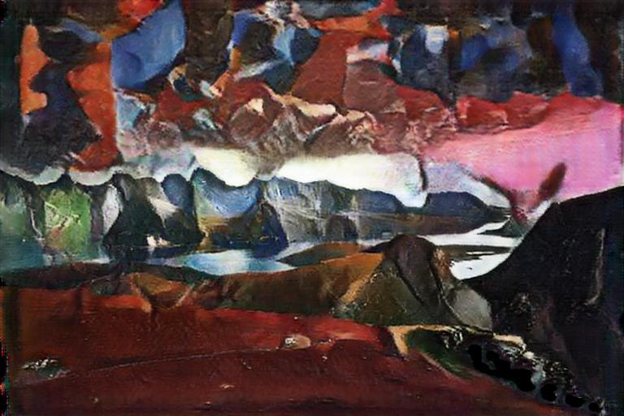
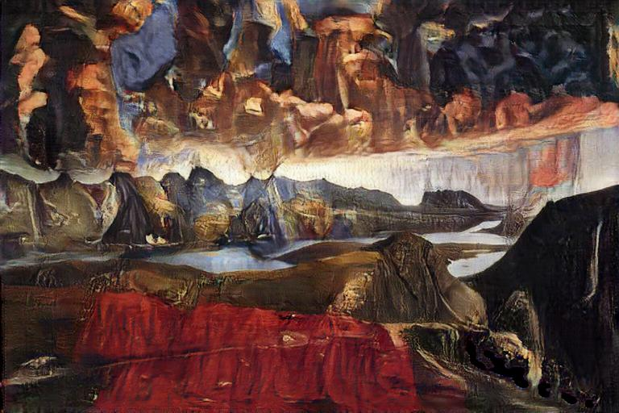
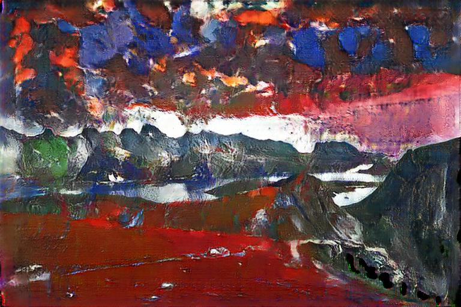

# DLS-TelegramBot

    
    
    

 

## Overview
Этот репозиторий содержит код телеграм-бота, выполненный в качестве финального проекта для Deep Learning School.

Основные возможности бота:
* Neural Style Transfer - передача стиля одного изображения на второе.
* Быстрое нанесение стиля на изображение с помощью CycleGan. Доступны три стиля: кубизм, экспресионизм, ранний ренесанс.
* Super resolution - повышение разрешения изображения с помощью ESRGAN.

Код бота выполнен на асинхронном фреймворке aiogram. В качестве фреймворка глубокого обучения используется PyTorch.

Бот имеет простой интерфейс и все необходимые подсказки для того, чтобы пользователь не запутался при использовании.
## Training CycleGAN
В качестве CycleGan взята собственная реализация с Unet в качестве генератора. Код тренировки доступен в файле train.ipynb/

Изображения для каждого из трех стилей были взяты из соревнования [Painter by Numbers](https://www.kaggle.com/c/painter-by-numbers/data).
Это соревнование содержит большое количество изображений различных стиле собраных в основном с сайта [WikiArt.org](https://www.wikiart.org/).
Фотографии второго множества из датасета ukiyoe2photo, плюс дополнительно собрано 1500 картинок с людьми из яндекс-картинок,
так как изначально датасет содержит в основном изображения природы.

Пример работы сети:

    
     
    
    
    

